# Simple Nest Js Auth Project

### How to ?
Install these packages. To do so just add these in terminal and hit `Enter`
```
npm install nestjs
npm install @nestjs/config
npm install @nestjs/mongoose
npm install class-validator
npm install class-transformer
npm install @nestjs/passport
npm install @nestjs/jwt
npm install passport-jwt
npm install bcryptjs
npm install -D @types/multer
npm install express
npm install @nestjs/platform-express
npm install multer
npm install express
npm install path
npm install --save @nestjs/swagger@8.1.1
npm install --save-dev prettier
npx prettier --write .

```

## Using APIs
Inorder to view all available APIs launch the provided API
```
http://localhost:3000/api/
```
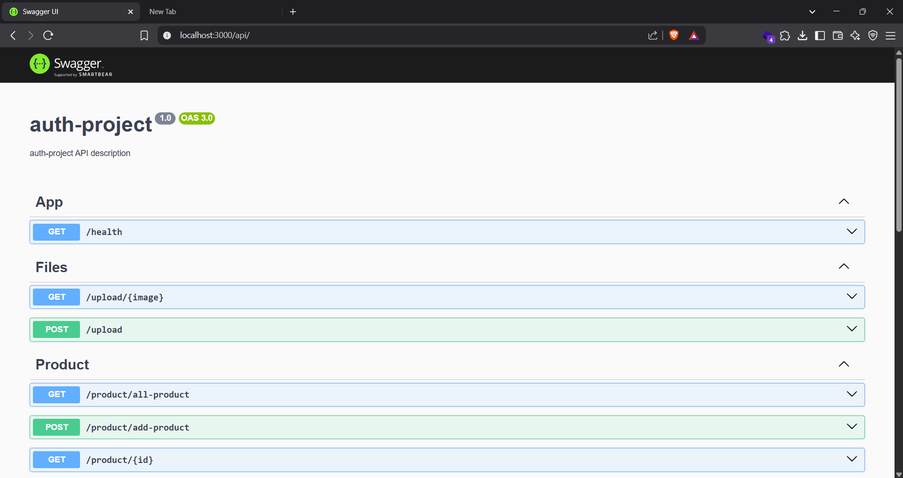

# APIs and Payload
## Health
> This is a default API to ensure our project is functional
```
http://localhost:3000/health
```
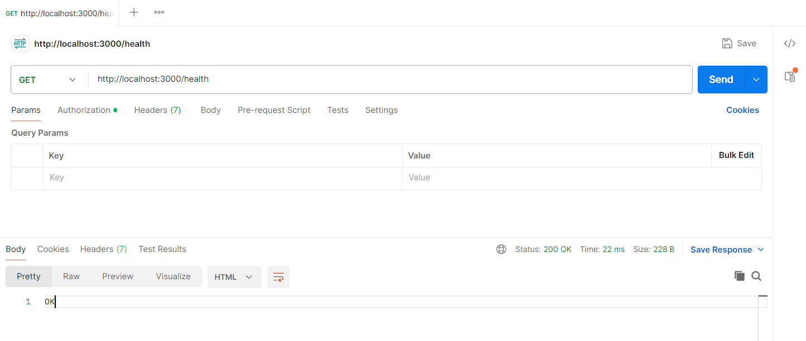

## Auth
- SignUp 
> Use this API to signup user
<br>

`POST`
```
http://localhost:3000/auth/signup
```
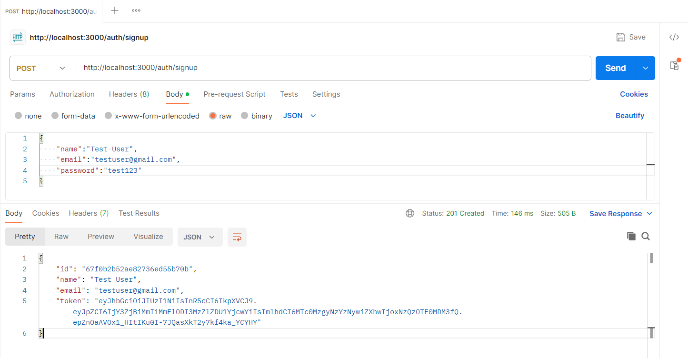


- Login
> Use this API to login user
<br>

`POST`
```
http://localhost:3000/auth/login
```
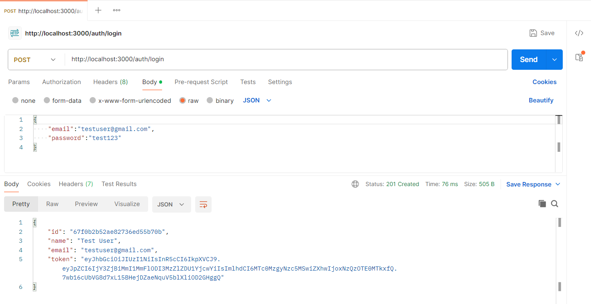


- User [GUARDED]
> Use this API to fetch user's own profile. 
<br>

`GET`
```
http://localhost:3000/auth/user
```
Note: As this endpoint has **RouteGuard** you'll need to pass token obtained during login/register as Bearer Token through Header.
<br>
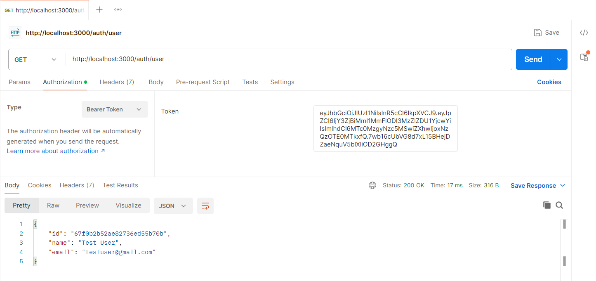


- Update User [GUARDED]
> Use this API to update user. 
<br>

`PUT`
```
http://localhost:3000/auth/update-user
```
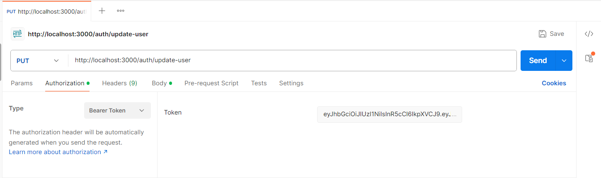
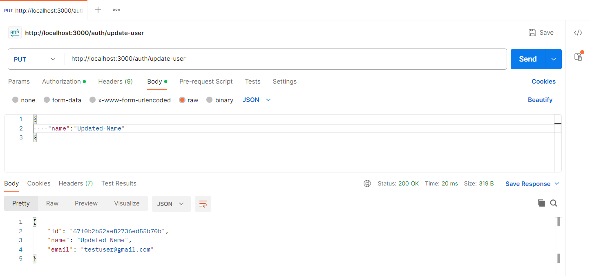

## Product
- Add Product [GUARDED]
> Use this API to add product
```
http://localhost:3000/product/add-product
```
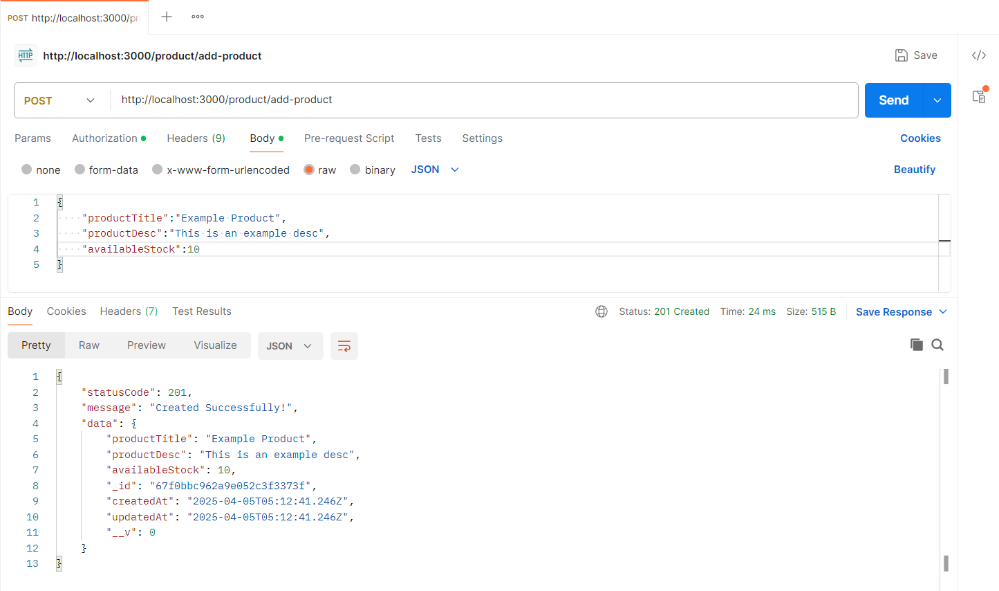

- Get All Product
> Use this API to fetch all available products

`GET`
```
http://localhost:3000/product/all-product
```
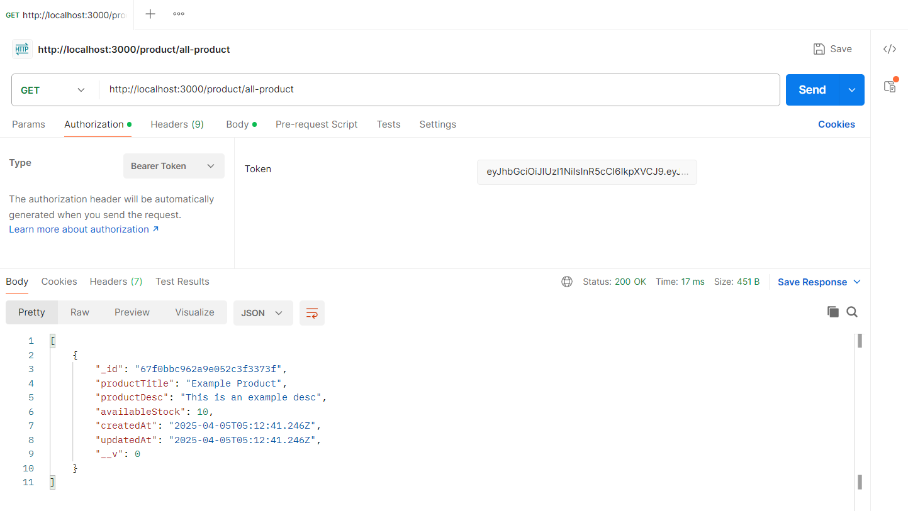

- Get Product (Single) [GUARDED]
> Use this API to fetch individual product
<br>

`GET`
```
http://localhost:3000/product/<PLACE_PRODUCT_ID_HERE>
```
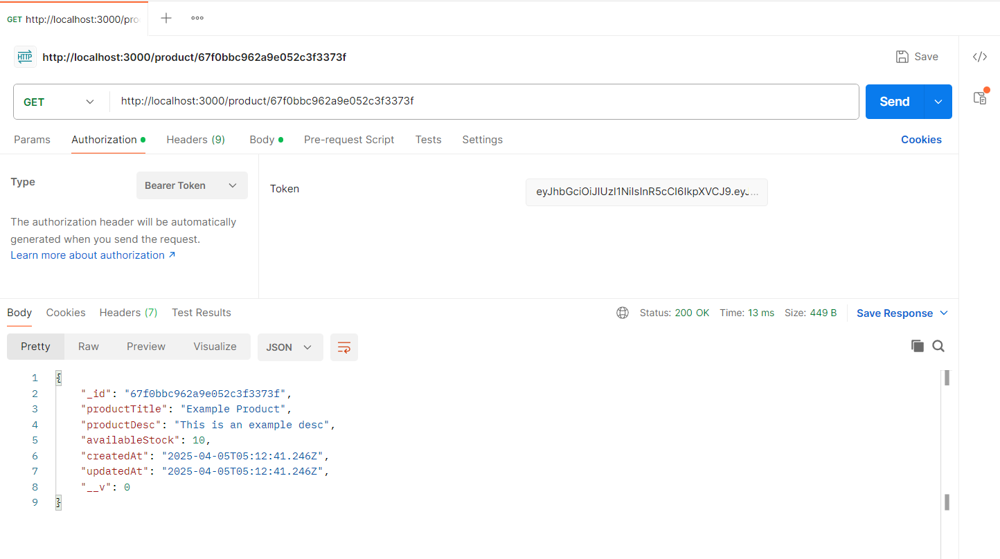


- Update Product (Single) [GUARDED]
> Use this API to update individual product
<br>

`PUT`
```
http://localhost:3000/product/<PLACE_PRODUCT_ID_HERE>
```
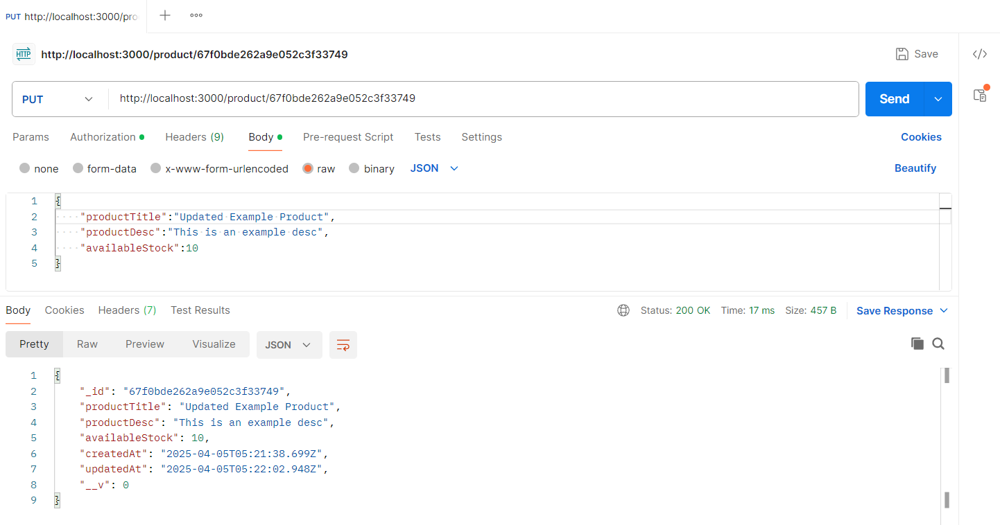


- Delete Product (Single) [GUARDED]
> Use this API to delete individual product
<br>

`DELETE`
```
http://localhost:3000/product/<PLACE_PRODUCT_ID_HERE>
```
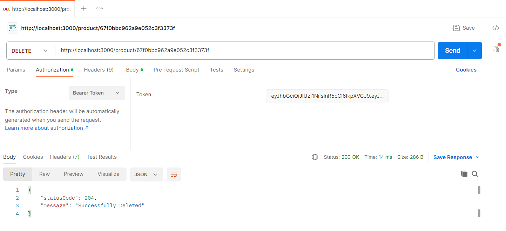


## Upload

- Upload File (Single) [GUARDED]
> Use this API to upload file
<br>

`POST`
```
http://localhost:3000/upload
```
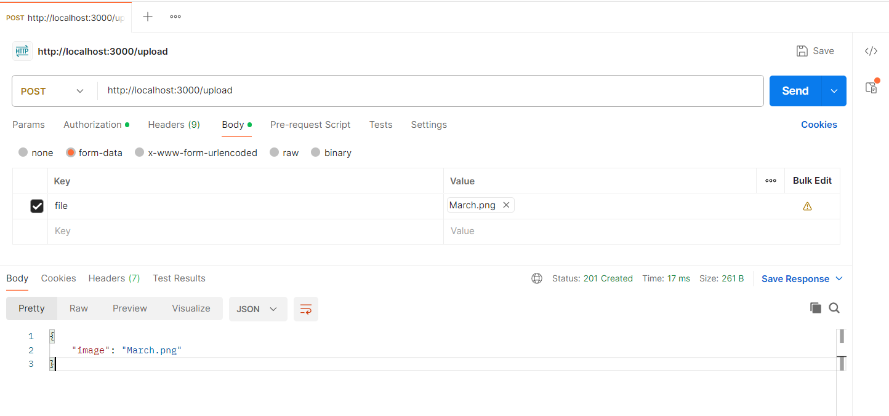
Inorder to view the uploaded image open your browser and load file in provided format
```
http://localhost:3000/upload/<FILE_NAME>
```
